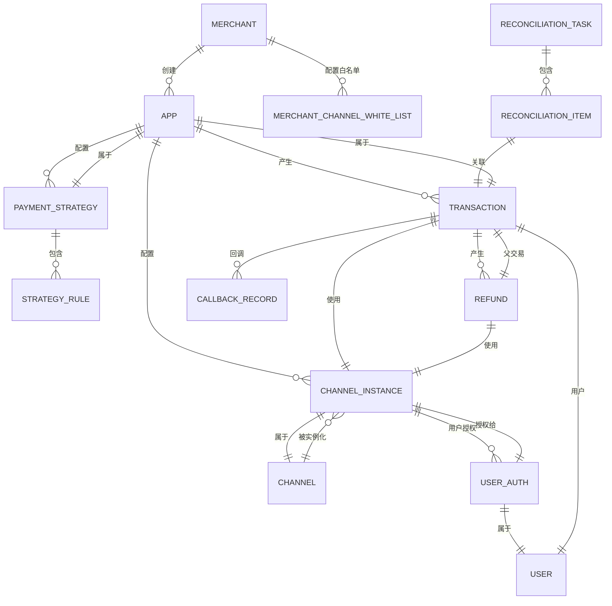

# ER 模型

## 1. 实体关系图



---

## 2. 表结构设计

### 2.1 商户相关

#### `merchant`（商户）

| 字段 | 类型 | 说明 |
|------|------|------|
| id | BIGINT PK | 主键，自增 |
| external_id | VARCHAR(64) | 外部系统商户标识（可选） |
| name | VARCHAR(128) | 商户名称 |
| company_name | VARCHAR(128) | 公司全称 |
| unified_code | VARCHAR(32) | 统一社会信用代码 |
| legal_person | VARCHAR(64) | 法人姓名 |
| legal_id_card | VARCHAR(32) | 法人身份证号 |
| contact_name | VARCHAR(64) | 联系人姓名 |
| contact_phone | VARCHAR(20) | 联系电话 |
| contact_email | VARCHAR(128) | 联系邮箱 |
| status | TINYINT | 状态：0-待认证、1-认证中、2-已认证、3-暂停、4-封禁 |
| cert_status | TINYINT | 认证状态 |
| cert_reviewer | VARCHAR(64) | 审核人 |
| cert_review_time | DATETIME | 审核时间 |
| created_at | DATETIME | 创建时间 |
| updated_at | DATETIME | 更新时间 |

#### `merchant_channel_white_list`（商户白名单）

| 字段 | 类型 | 说明 |
|------|------|------|
| id | BIGINT PK | 主键 |
| merchant_id | BIGINT FK | 商户 ID |
| channel_code | VARCHAR(32) | 通道编码 |
| enabled | BOOLEAN | 是否启用 |
| memo | VARCHAR(256) | 备注 |

> 说明：用于控制哪些商户可以使用哪些通道（商务签约限制）。

---

### 2.2 应用相关

#### `app`（应用）

| 字段 | 类型 | 说明 |
|------|------|------|
| id | BIGINT PK | 主键 |
| merchant_id | BIGINT FK | 所属商户 |
| appid | VARCHAR(32) UNIQUE | 平台分配的唯一应用标识 |
| name | VARCHAR(128) | 应用名称 |
| type | TINYINT | 应用类型：1-电商、2-服务、3-直播、4-其他 |
| callback_url | VARCHAR(512) | 商户回调地址 |
| return_url | VARCHAR(512) | 同步跳转地址 |
| status | TINYINT | 状态：0-草稿、1-启用、2-停用 |
| created_at | DATETIME | 创建时间 |
| updated_at | DATETIME | 更新时间 |

> `appid` 生成规则：`app_` + 时间戳后 8 位 + 随机 4 位，如 `app_16280123_a7f3`

---

### 2.3 通道相关

#### `channel`（支付通道元信息）

| 字段 | 类型 | 说明 |
|------|------|------|
| code | VARCHAR(32) PK | 通道编码，如 `wx_jsapi`、`alipay_trade` |
| name | VARCHAR(128) | 通道名称，如「微信支付 JSAPI」 |
| adapter_class | VARCHAR(256) | 适配器类的全限定名 |
| version | VARCHAR(16) | 适配器版本 |
| status | TINYINT | 状态：0-未启用、1-启用、2-维护中 |
| scenes | JSON | 支持的场景列表，如 `["ecommerce","live","app"]` |
| config_template | JSON | 配置模板（字段定义、默认值） |
| created_at | DATETIME | 创建时间 |
| updated_at | DATETIME | 更新时间 |

#### `channel_instance`（渠道实例配置）

| 字段 | 类型 | 说明 |
|------|------|------|
| id | BIGINT PK | 主键 |
| app_id | BIGINT FK | 所属应用 |
| channel_code | VARCHAR(32) FK | 通道编码 |
| instance_name | VARCHAR(128) | 实例名称（商户自定义） |
| config | JSON | 通道配置（密钥、商户号等，敏感字段加密存储） |
| fees | JSON | 费率配置，如 `{"rate": 0.006, "caps": {"min": 1, "max": 50000}}` |
| amount_limit | JSON | 额度限制，如 `{"single_max": 50000, "daily_max": 500000}` |
| priority | TINYINT | 实例优先级（同一通道多实例时） |
| status | TINYINT | 状态：0-未配置、1-已配置、2-测试中、3-正常、4-异常 |
| test_result | JSON | 最近测试结果 |
| memo | VARCHAR(256) | 备注 |
| created_at | DATETIME | 创建时间 |
| updated_at | DATETIME | 更新时间 |

> 说明：一个应用可以对同一通道配置多个实例（如微信有 JSAPI 和 Native 两种模式），通过实例名称区分。

#### `channel`表初始数据示例

```sql
INSERT INTO channel (code, name, adapter_class, version, status, scenes, config_template) VALUES
('wx_jsapi', '微信支付 JSAPI', 'com.pay.channel.wechat.WeChatJSAPIAdapter', '1.0.0', 1, '["ecommerce","app","h5"]', '{"fields":[{"name":"appid","type":"string","required":true},{"name":"mch_id","type":"string","required":true},{"name":"secret","type":"string","required":true,"encrypted":true},{"name":"cert_path","type":"string","required":true},{"name":"key_path","type":"string","required":true}]}'::json),
('alipay_trade', '支付宝电脑网站支付', 'com.pay.channel.alipay.AlipayTradeAdapter', '1.0.0', 1, '["ecommerce","h5"]', '{"fields":[{"name":"app_id","type":"string","required":true},{"name":"merchant_private_key","type":"string","required":true,"encrypted":true},{"name":"alipay_public_key","type":"string","required":true}]}'::json),
('zj_payment', '中金支付', 'com.pay.channel.zj.ZjPaymentAdapter', '1.0.0', 1, '["ecommerce","app"]', '{}'::json),
('bf_payment', '宝付支付', 'com.pay.channel.bf.BfPaymentAdapter', '1.0.0', 1, '["ecommerce","live"]', '{}'::json);
```

---

### 2.4 策略相关

#### `payment_strategy`（支付策略）

| 字段 | 类型 | 说明 |
|------|------|------|
| id | BIGINT PK | 主键 |
| app_id | BIGINT FK | 所属应用 |
| name | VARCHAR(128) | 策略名称 |
| description | VARCHAR(512) | 描述 |
| version | INT | 版本号（每次修改递增） |
| status | TINYINT | 状态：0-草稿、1-已发布、2-已失效 |
| fallback_policy | JSON | 容错策略，如 `{"enabled": true, "max_attempts": 3, "require_re_authorization": false}` |
| created_by | BIGINT FK | 创建人（商户管理员 ID） |
| created_at | DATETIME | 创建时间 |
| updated_at | DATETIME | 更新时间 |
| published_at | DATETIME | 发布时间 |
| published_by | BIGINT FK | 发布人 |

#### `strategy_rule`（策略规则）

| 字段 | 类型 | 说明 |
|------|------|------|
| id | BIGINT PK | 主键 |
| strategy_id | BIGINT FK | 所属策略 |
| priority | TINYINT | 优先级（数字越小越优先） |
| name | VARCHAR(128) | 规则名称 |
| description | VARCHAR(512) | 描述 |
| condition | JSON | 条件表达式，如 `{"amount_range": [0, 100], "scene": "ecommerce", "region": null, "device": null, "risk_level": 0}` |
| channels | JSON | 候选通道列表（channel_code 数组），如 `["wx_jsapi", "alipay_trade", "zj_payment"]` |
| sort_by | VARCHAR(32) | 排序方式：`fee_rate_asc`、`fee_rate_desc`、`limit_first`、`latency_asc` |
| created_at | DATETIME | 创建时间 |
| updated_at | DATETIME | 更新时间 |

> 说明：规则按 priority 升序排序，第一个匹配的规则生效。

---

### 2.5 授权相关

#### `user`（终端用户）

| 字段 | 类型 | 说明 |
|------|------|------|
| id | BIGINT PK | 主键 |
| open_id | VARCHAR(128) | 平台生成的用户唯一标识 |
| merchant_id | BIGINT FK | 关联商户（可选，用户可能跨商户使用） |
| mobile | VARCHAR(20) | 手机号（可选） |
| avatar | VARCHAR(512) | 头像 |
| status | TINYINT | 状态：1-正常、2-冻结 |
| created_at | DATETIME | 创建时间 |
| updated_at | DATETIME | 更新时间 |

#### `user_auth`（用户授权记录）

| 字段 | 类型 | 说明 |
|------|------|------|
| id | BIGINT PK | 主键 |
| user_id | BIGINT FK | 用户 ID |
| app_id | BIGINT FK | 所属应用 |
| channel_code | VARCHAR(32) | 通道编码 |
| channel_instance_id | BIGINT FK | 具体的渠道实例 |
| auth_type | TINYINT | 授权类型：1-单独授权、2-综合授权 |
| auth_status | TINYINT | 状态：0-未授权、1-已授权、2-授权失败、3-已拒绝、4-授权过期 |
| auth_token | VARCHAR(512) | 第三方返回的授权凭证/Token（加密存储） |
| refresh_token | VARCHAR(512) | 刷新_token（如有） |
| auth_time | DATETIME | 授权时间 |
| expires_at | DATETIME | 授权过期时间 |
| auth_channel | VARCHAR(32) | 授权来源渠道 |
| memo | VARCHAR(256) | 备注 |
| created_at | DATETIME | 创建时间 |
| updated_at | DATETIME | 更新时间 |

> 说明：综合授权时，系统为应用下所有候选通道创建对应的 `user_auth` 记录，`auth_type = 2`。

#### `user_channel_binding`（用户-渠道绑定关系）

| 字段 | 类型 | 说明 |
|------|------|------|
| id | BIGINT PK | 主键 |
| user_id | BIGINT FK | 用户 ID |
| app_id | BIGINT FK | 应用 ID |
| channel_code | VARCHAR(32) | 通道编码 |
| channel_instance_id | BIGINT FK | 渠道实例 ID |
| bind_time | DATETIME | 绑定时间（首次使用此通道支付成功时） |
| last_used_at | DATETIME | 最近使用时间 |
| use_count | INT | 使用次数 |
| status | TINYINT | 状态：1-正常、2-停用 |
| created_at | DATETIME | 创建时间 |
| updated_at | DATETIME | 更新时间 |

> 说明：记录用户首选/最近使用的通道，用于退款时优先选择同一通道。

---

### 2.6 交易相关

#### `transaction`（交易记录）

| 字段 | 类型 | 说明 |
|------|------|------|
| id | BIGINT PK | 主键 |
| transaction_no | VARCHAR(64) UNIQUE | 平台交易流水号（格式：`pay_` + 时间戳 + 随机） |
| app_id | BIGINT FK | 所属应用 |
| user_id | BIGINT FK | 用户 ID |
| channel_code | VARCHAR(32) | 使用的通道编码 |
| channel_instance_id | BIGINT FK | 使用的渠道实例 |
| third_order_no | VARCHAR(128) | 第三方订单号 |
| order_type | TINYINT | 订单类型：1-支付、2-退款、3-查询、4-撤销 |
| amount | DECIMAL(16,2) | 金额（分/元，取决于通道） |
| currency | VARCHAR(8) | 货币代码，默认 CNY |
| status | TINYINT | 状态：0-待处理、1-处理中、2-成功、3-失败、4-部分成功、5-已关闭 |
| scene | VARCHAR(32) | 支付场景 |
| risk_level | TINYINT | 风控等级：0-正常、1-低风险、2-中风险、3-高风险 |
| risk_note | VARCHAR(256) | 风控备注 |
| metadata | JSON | 扩展字段（客户端 IP、设备信息等） |
| failure_reason | TEXT | 失败原因 |
| created_at | DATETIME | 创建时间 |
| updated_at | DATETIME | 更新时间 |
| paid_at | DATETIME | 支付成功时间 |
| closed_at | DATETIME | 关闭时间 |

#### `refund`（退款记录）

| 字段 | 类型 | 说明 |
|------|------|------|
| id | BIGINT PK | 主键 |
| refund_no | VARCHAR(64) UNIQUE | 退款流水号 |
| transaction_id | BIGINT FK | 关联的原支付交易 |
| app_id | BIGINT FK | 应用 ID |
| user_id | BIGINT FK | 用户 ID |
| channel_code | VARCHAR(32) | 使用的退款通道 |
| channel_instance_id | BIGINT FK | 退款使用的实例 |
| third_refund_no | VARCHAR(128) | 第三方退款号 |
| amount | DECIMAL(16,2) | 退款金额 |
| reason | VARCHAR(256) | 退款原因 |
| status | TINYINT | 状态：0-待处理、1-处理中、2-成功、3-失败 |
| failure_reason | TEXT | 失败原因 |
| created_at | DATETIME | 创建时间 |
| updated_at | DATETIME | 更新时间 |
| refunded_at | DATETIME | 退款成功时间 |

#### `callback_record`（回调记录）

| 字段 | 类型 | 说明 |
|------|------|------|
| id | BIGINT PK | 主键 |
| transaction_id | BIGINT FK | 关联交易 |
| callback_url | VARCHAR(512) | 回调目标地址 |
| callback_method | VARCHAR(16) | 方法：GET/POST |
| request_params | JSON | 回调请求参数 |
| callback_status | TINYINT | 状态：0-待发送、1-发送中、2-成功、3-失败、4-失败待重试 |
| retry_count | INT | 重试次数 |
| last_callback_time | DATETIME | 最近回调时间 |
| next_retry_time | DATETIME | 下次重试时间 |
| created_at | DATETIME | 创建时间 |
| updated_at | DATETIME | 更新时间 |

---

### 2.7 对账相关

#### `reconciliation_task`（对账任务）

| 字段 | 类型 | 说明 |
|------|------|------|
| id | BIGINT PK | 主键 |
| task_no | VARCHAR(64) UNIQUE | 任务编号 |
| app_id | BIGINT FK | 应用 ID（为空表示全局对账） |
| channel_code | VARCHAR(32) | 指定通道（为空表示全通道） |
| start_date | DATE | 对账起始日期 |
| end_date | DATE | 对账结束日期 |
| status | TINYINT | 状态：0-待执行、1-执行中、2-完成、3-部分完成、4-失败 |
| total_count | INT | 总交易数 |
| success_count | INT | 对账成功数 |
| diff_count | INT | 差异数 |
| started_at | DATETIME | 开始时间 |
| finished_at | DATETIME | 完成时间 |
| created_at | DATETIME | 创建时间 |

#### `reconciliation_item`（对账明细）

| 字段 | 类型 | 说明 |
|------|------|------|
| id | BIGINT PK | 主键 |
| task_id | BIGINT FK | 所属任务 |
| transaction_id | BIGINT FK | 关联交易 |
| channel_code | VARCHAR(32) | 通道编码 |
| third_order_no | VARCHAR(128) | 第三方订单号 |
| third_amount | DECIMAL(16,2) | 第三方金额 |
| third_status | VARCHAR(32) | 第三方状态 |
| platform_amount | DECIMAL(16,2) | 平台记录金额 |
| platform_status | VARCHAR(32) | 平台状态 |
| match_result | TINYINT | 匹配结果：0-一致、1-金额不一致、2-状态不一致、3-订单不存在 |
| diff_detail | TEXT | 差异详情 |
| created_at | DATETIME | 创建时间 |

---

### 2.8 系统配置相关

#### `system_config`（系统配置）

| 字段 | 类型 | 说明 |
|------|------|------|
| id | BIGINT PK | 主键 |
| key | VARCHAR(128) UNIQUE | 配置键 |
| value | TEXT | 配置值 |
| description | VARCHAR(256) | 描述 |
| updated_at | DATETIME | 更新时间 |

常用配置项：

| key | value 示例 | 说明 |
|-----|-----------|------|
| `global.fallback_enabled` | `true` | 全局是否启用容错 |
| `global.default_max_attempts` | `3` | 默认最大尝试次数 |
| `global.health_check_interval` | `30` | 通道健康检查间隔（秒） |
| `global.reconciliation.cron` | `0 2 * * *` | 对账定时任务 Cron |

---

### 2.9 日志表

#### `operation_log`（操作日志）

| 字段 | 类型 | 说明 |
|------|------|------|
| id | BIGINT PK | 主键 |
| operator_type | TINYINT | 操作类型：1-商户管理员、2-平台管理员 |
| operator_id | BIGINT | 操作人 ID |
| operation | VARCHAR(128) | 操作名称 |
| target_type | VARCHAR(32) | 目标类型 |
| target_id | VARCHAR(64) | 目标 ID |
| result | TINYINT | 结果：1-成功、2-失败 |
| detail | TEXT | 操作详情 |
| ip | VARCHAR(45) | 操作 IP |
| created_at | DATETIME | 创建时间 |

---

## 3. 关键 ER 关系说明

### 3.1 应用 ↔ 通道实例

- 一个应用可以配置多个通道实例
- 一个通道实例只属于一个应用
- 通道实例通过 `channel_code` 关联到通道元信息

### 3.2 策略 ↔ 规则

- 一个策略包含多条规则
- 规则按 priority 排序，第一个匹配的规则生效
- 规则中的 channels 字段存储候选通道编码数组

### 3.3 用户授权

- 用户对应用下的每个通道实例都有独立的授权记录
- 综合授权创建多个 user_auth 记录（auth_type = 2）
- user_channel_binding 记录用户首选通道，用于退款路由

### 3.4 交易 ↔ 通道

- 每笔交易记录使用了哪个通道和哪个实例
- 退款优先使用原交易的通道
- 对账时根据交易记录的通道去查询第三方

---

## 4. 索引设计

### 4.1 主要索引

```sql
-- merchant 表
CREATE INDEX idx_merchant_status ON merchant(status);
CREATE INDEX idx_merchant_unified_code ON merchant(unified_code);

-- app 表
CREATE INDEX idx_app_merchant_id ON app(merchant_id);
CREATE INDEX idx_app_status ON app(status);

-- channel_instance 表
CREATE INDEX idx_channel_instance_app_id ON channel_instance(app_id);
CREATE INDEX idx_channel_instance_code ON channel_instance(channel_code);
CREATE INDEX idx_channel_instance_status ON channel_instance(status);

-- payment_strategy 表
CREATE INDEX idx_strategy_app_id ON payment_strategy(app_id);
CREATE INDEX idx_strategy_status ON payment_strategy(status);

-- strategy_rule 表
CREATE INDEX idx_rule_strategy_id ON strategy_rule(strategy_id);

-- user_auth 表
CREATE INDEX idx_user_auth_user_id ON user_auth(user_id);
CREATE INDEX idx_user_auth_app_id ON user_auth(app_id);
CREATE INDEX idx_user_auth_channel_code ON user_auth(channel_code);
CREATE INDEX idx_user_auth_status ON user_auth(auth_status);
CREATE INDEX idx_user_auth_user_app_channel ON user_auth(user_id, app_id, channel_code);

-- transaction 表
CREATE INDEX idx_transaction_no ON transaction(transaction_no);
CREATE INDEX idx_transaction_app_id ON transaction(app_id);
CREATE INDEX idx_transaction_user_id ON transaction(user_id);
CREATE INDEX idx_transaction_channel_code ON transaction(channel_code);
CREATE INDEX idx_transaction_status ON transaction(status);
CREATE INDEX idx_transaction_created_at ON transaction(created_at);
CREATE INDEX idx_transaction_third_order ON transaction(third_order_no);

-- refund 表
CREATE INDEX idx_refund_no ON refund(refund_no);
CREATE INDEX idx_refund_transaction_id ON refund(transaction_id);

-- callback_record 表
CREATE INDEX idx_callback_transaction_id ON callback_record(transaction_id);
CREATE INDEX idx_callback_status ON callback_record(callback_status);

-- reconciliation_task 表
CREATE INDEX idx_recon_task_app_id ON reconciliation_task(app_id);
CREATE INDEX idx_recon_task_status ON reconciliation_task(status);

-- reconciliation_item 表
CREATE INDEX idx_recon_item_task_id ON reconciliation_item(task_id);
CREATE INDEX idx_recon_item_transaction_id ON reconciliation_item(transaction_id);
CREATE INDEX idx_recon_match_result ON reconciliation_item(match_result);
```

---

## 5. 数据一致性设计

### 5.1 支付状态机

```
[创建] → [处理中] → [成功] → [已关闭]
                 ↓
              [失败]
```

- 交易创建 → 状态 `0`（待处理）
- 路由引擎开始执行 → 状态 `1`（处理中）
- 第三方支付成功回调/查询确认 → 状态 `2`（成功），记录 `paid_at`
- 第三方失败 → 状态 `3`（失败），记录 `failure_reason`
- 超时未付款（如 24 小时） → 状态 `5`（已关闭），记录 `closed_at`

### 5.2  idempotency（幂等性）

- `transaction_no` 作为幂等键
- 商户调用创建订单 API 时传递 `merchant_order_no`，平台去重
- 退款时传递 `refund_no` 作为幂等键

### 5.3 分布式事务（可选）

- 对于核心支付流程，建议使用消息队列 + 重试机制保证最终一致性
- 回调失败的消息进入重试队列，最多重试 10 次，间隔 exponentially backoff

---

*更多细节请参阅：业务流程图.md、时序图.md、API接口文档.md*
