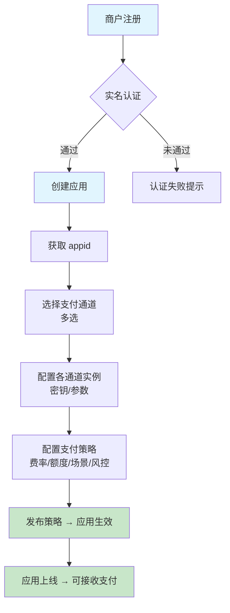
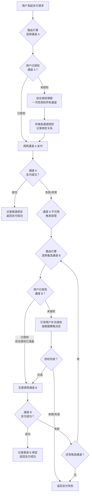
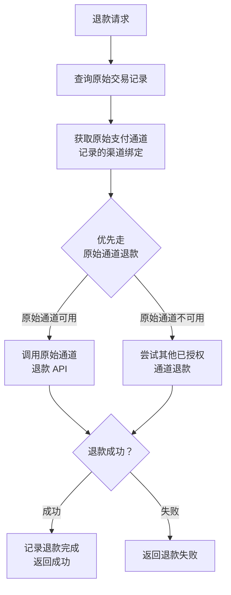
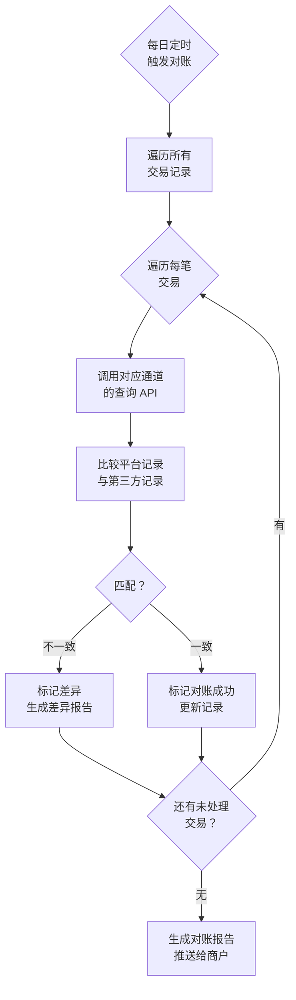
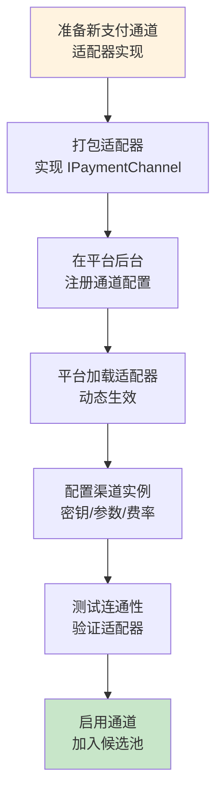
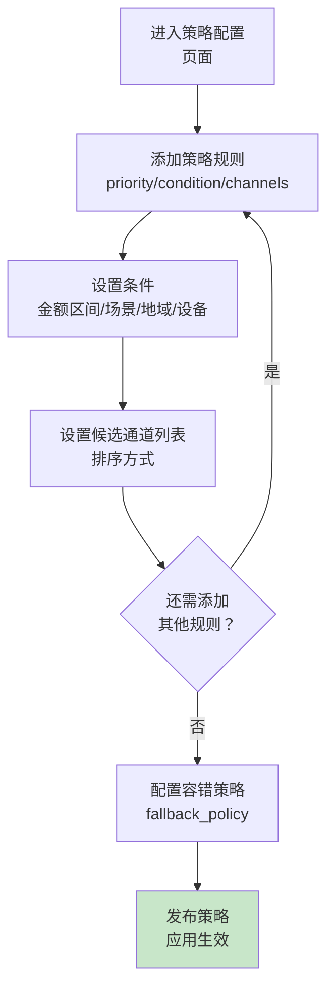

# 业务流程图

## 1. 商户接入全流程

## 2. 终端用户支付全流程（含无感容错）

## 3. 退款流程

## 4. 对账流程

## 5. 通道接入流程（新通道配置化）

## 6. 策略配置流程

---

## 流程说明

### 6.1 商户接入
1. 商户在平台注册并完成实名认证
2. 创建支付应用，获得唯一 `appid`
3. 从可用支付通道列表中选择需要接入的通道（可多选）
4. 为每个选中的通道配置具体实例：密钥、第三方商户号、费率、额度限制等
5. 配置支付策略：定义多条规则，每条规则关联条件和候选通道列表
6. 发布策略后，应用正式上线，开始接收支付请求

### 6.2 用户支付（核心）
1. 用户在商户应用下发起支付请求
2. 路由引擎根据已发布的策略，匹配最优规则，选择候选通道列表中的最佳通道 A
3. 检查用户是否已对通道 A 授权
4. 若已授权：直接调用通道 A 执行支付
5. 若未授权：引导用户进行「综合授权」，一次性取得所有候选通道的授权
6. 支付成功后，记录渠道绑定关系（用户-应用-通道）
7. 若通道 A 不可用：触发容错，路由引擎从候选列表中选择下一个通道 B
8. 检查用户是否已对通道 B 授权（若已执行综合授权，则已涵盖）
9. 若已授权：无感切换，调用通道 B
10. 若未授权：根据策略的 `fallback_policy` 决定是否需要用户再次授权
11. 循环尝试直至支付成功或所有候选通道耗尽

### 6.3 综合授权优势
- 用户仅需在首次支付时完成一次授权操作
- 后续任何通道切换均无需用户感知
- 降低支付失败率，提升用户体验
- 商户无需为每个通道单独开发授权流程

### 6.4 容错策略等级

| 等级 | 配置 | 行为 |
|------|------|------|
| **无感模式** | `require_re_authorization: false` | 所有候选通道均已预授权，切换完全无感 |
| **降级提示** | `require_re_authorization: true` | 备用通道未授权时，提示用户快速授权 |
| **终止模式** | `fallback: disabled` | 原通道失败即终止，不尝试备用 |

---

*更多细节请参阅：时序图.md、用例模型.md*
