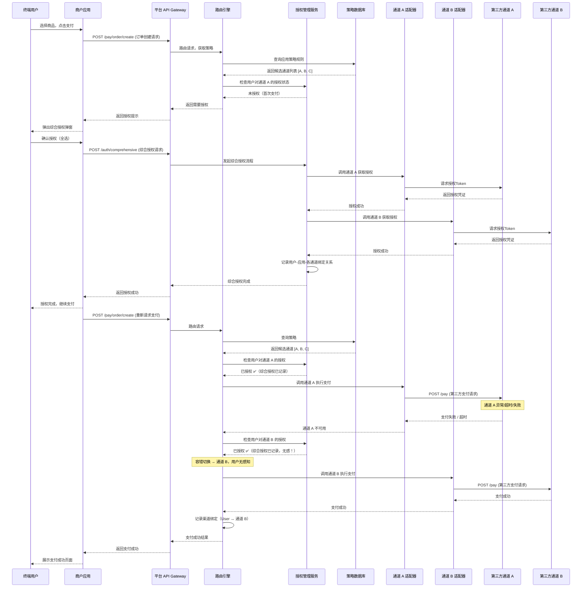
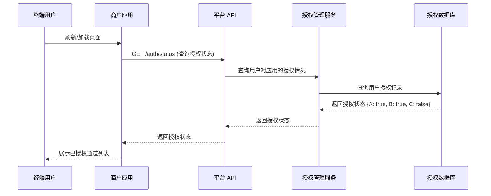
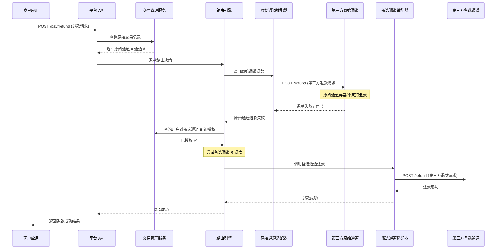
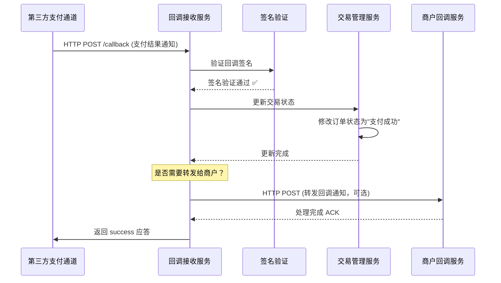
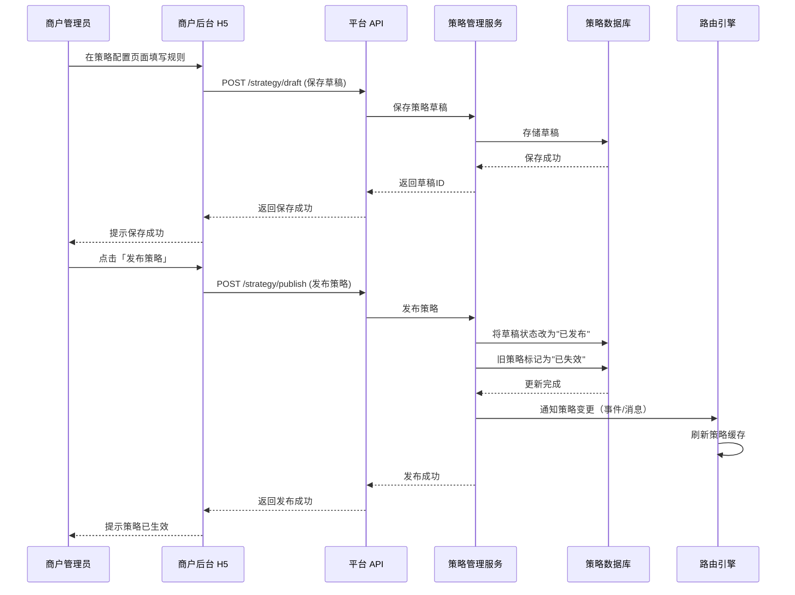
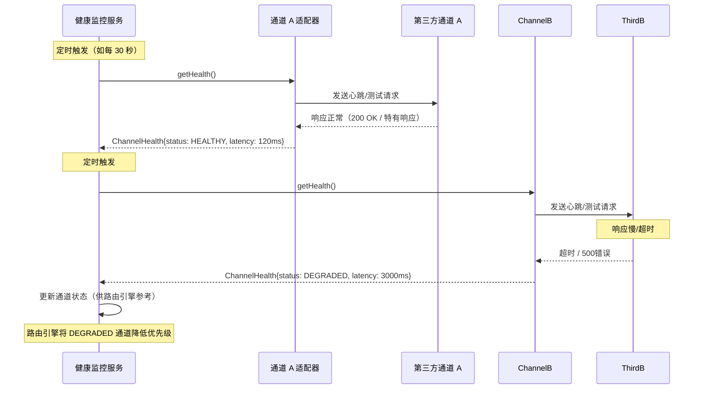

# 时序图 (Sequence Diagrams)

## 1. 支付全流程时序图（含综合授权 + 容错切换）

---

## 2. 授权状态查询时序图

---

## 3. 退款时序图

---

## 4. 回调处理时序图

---

## 5. 策略发布时序图

---

## 6. 通道健康检查时序图

---

## 时序图说明

### 关键交互点

| 环节 | 说明 |
|------|------|
| **综合授权** | 用户首次支付时弹窗，一次性取得所有候选通道的授权凭证，后续切换完全无感 |
| **容错切换** | 通道 A 不可用时，路由引擎自动选择通道 B；因已综合授权，用户无需再次操作 |
| **渠道绑定** | 每次支付成功后，记录用户-应用-通道的绑定关系，退款时优先走同一通道 |
| **回调处理** | 第三方异步通知，经过签名验证后更新交易状态，可选转发给商户 |

### 设计意图

- **用户无感**：通过综合授权，将通道切换的复杂性屏蔽在用户视野之外
- **可用性优先**：路由引擎结合策略规则 + 实时通道健康状态，选择最优通道
- **可扩展**：适配器模式使得新通道接入只需实现接口 + 配置，不需要修改核心逻辑

---

*更多细节请参阅：业务流程图.md、用例模型.md、ER模型.md*
